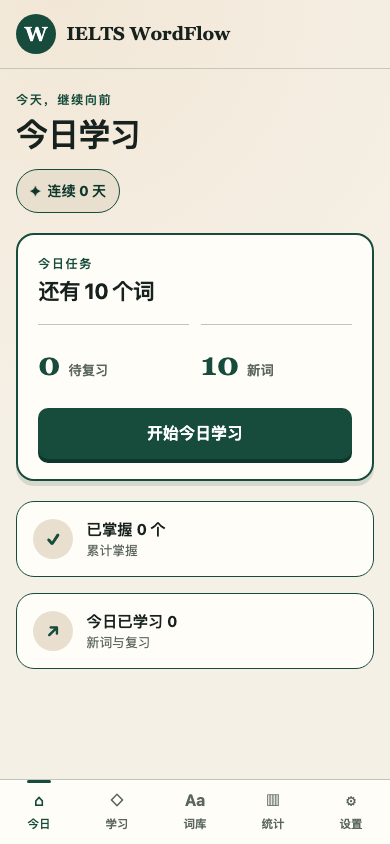
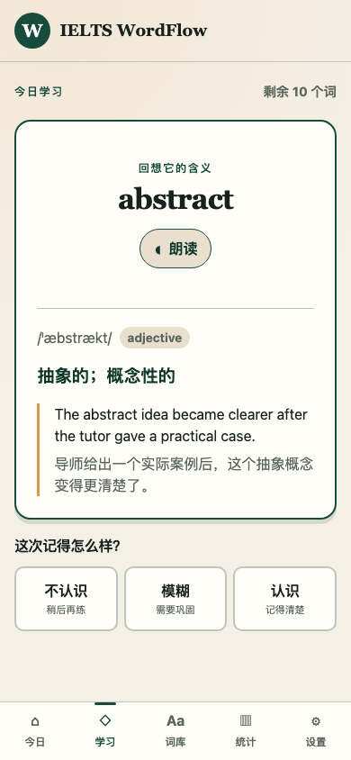
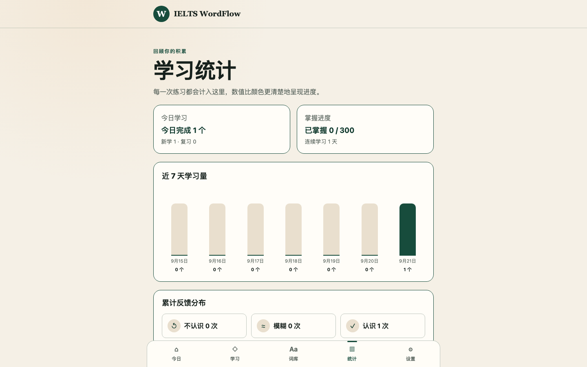

# IELTS WordFlow

[English](README.md)

IELTS WordFlow 是一款面向雅思 6–6.5 分学习者的中文离线优先词汇工具。应用内置 300 个独立编写的单词与例句，提供间隔复习队列、本地学习记录以及 JSON 备份和恢复功能。

## 截图

<p align="center">
  
  
</p>



这些图片均在发布前视觉检查时从生产构建中截取。

## 功能

- 每日队列会合并到期复习词和 10、20 或 30 个可配置的新词。
- 先回忆、再显示答案，并用“不认识”“模糊”“认识”完成反馈。
- 可搜索 300 词词库，按学习状态筛选并查看单词详情。
- 展示当日数量、掌握进度、连续学习天数和七日活动图表。
- 可选用浏览器提供的英式英语语音朗读。
- 支持安装为 PWA；首次成功加载后可离线学习，也支持仓库路径下的直接链接。
- 支持带版本的 JSON 导出、导入，以及经过确认的进度重置。

## 隐私与本地数据

IELTS WordFlow 不提供账号系统，也不包含分析、广告或遥测。设置、单词进度和每日统计只保存在当前浏览器配置文件的 IndexedDB 中。备份文件由浏览器直接下载，应用不会上传备份。

浏览器本地存储并不是永久存储。清除网站数据或浏览器存储、使用临时/隐私浏览配置、重置浏览器或丢失设备，都可能删除全部学习进度。建议定期通过**设置 → 导出数据**生成备份，并保存到安全位置。导入备份只会在确认后替换当前浏览器中的学习数据。

## 浏览器支持

项目的目标浏览器是当前稳定版 Chrome、Edge、Firefox 和 Safari，并要求启用 JavaScript、IndexedDB 与 Service Worker。目前自动化生产验收使用 Chromium；若发布内容影响浏览器行为，还应在 Firefox 和 Safari 中做人工冒烟测试。安装提示和具体 PWA 行为会因浏览器及操作系统而异。朗读功能要求浏览器或操作系统提供语言标记为英式英语（`en-GB`）的语音；如果只安装了其他英语语音，朗读按钮会保持不可用，但其他学习功能仍可正常使用。

## 安装与开发

项目使用 Node.js 20.19.0（见 `.nvmrc`），npm 按已提交的锁文件安装依赖。

```sh
nvm use
npm ci
npm run dev
```

开发服务器会输出本地地址。生产构建写入 `dist`：

```sh
npm run build
npm run preview
```

## 校验与测试

首次在本地运行端到端测试前，安装与项目 Playwright 1.55 完全匹配的 Chromium：

```sh
npm run e2e:install
```

可通过以下仓库脚本分别运行各项检查：

```sh
npm run validate:vocabulary
npm run test
npm run typecheck
npm run lint
npm run build
npm run e2e
```

交互式开发单元测试可使用 `npm run test:watch`。

## GitHub Pages 部署

生产路径前缀是 `/ielts-wordflow/`，定义在 `src/app/pwaConfig.ts` 中。`.github/workflows/pages.yml` 会校验仓库、构建 `dist`、运行 Chromium 验收测试、上传该目录作为 Pages 构件，并且只从 `main` 分支部署。配套的 `404.html` 重定向会保留仓库路径下的直接链接。

若 fork 使用不同的仓库名，部署前必须修改共享的路径前缀。

## 架构

- `src/app` 负责组合 Provider、路由、首页状态和共享 PWA 配置。
- `src/pages` 与 `src/components` 实现可访问的 React 界面。
- `src/features` 包含词汇、调度、学习会话和进度领域逻辑。
- `src/lib/storage` 负责 Dexie/IndexedDB 仓库与带版本的备份格式。
- `src/lib/speech` 隔离可选的 Web Speech API 行为。
- `public` 包含安装图标以及 Pages/离线回退页面。
- `scripts` 负责校验数据、模拟 Pages 生产服务并检查发布元数据。
- `tests/e2e` 使用 Playwright Chromium 验收构建后的 PWA。

应用在构建时打包词汇和静态外壳。React 通过存储仓库读写学习状态，Service Worker 缓存生产资源以便后续离线使用。

## 公开仓库发布顺序

仓库设为公开后，仓库管理员必须立即在 **Settings → Security → Code security and analysis** 中启用 **Private vulnerability reporting**（私密漏洞报告）。请确认 **Security** 标签页中的 **Report a vulnerability** 会打开由 GitHub Security Advisories 支持的私密报告入口。在宣布或发布版本、广泛分享仓库或接受外部访问之前，必须完成并验证此设置；敏感报告不能改用公开 Issue 或私人邮箱接收。

## 参与贡献

提交 Pull Request 前请阅读 [CONTRIBUTING.md](CONTRIBUTING.md)。欢迎使用仓库的 Issue 模板报告缺陷或提出功能建议。社区参与需遵守 [CODE_OF_CONDUCT.md](CODE_OF_CONDUCT.md)，敏感漏洞请按 [SECURITY.md](SECURITY.md) 私下报告。

## 许可证

软件源代码采用 [MIT License](LICENSE)。

`src/features/vocabulary/data/core-1.json`、`core-2.json` 和 `core-3.json` 中的 300 词词汇数据是独立作品，另行采用 [CC BY 4.0](https://creativecommons.org/licenses/by/4.0/) 许可。复用这些数据时必须署名、提供许可证链接并说明是否做过修改。来源说明和数据许可的准确范围见 [DATA_SOURCES.md](DATA_SOURCES.md)。
